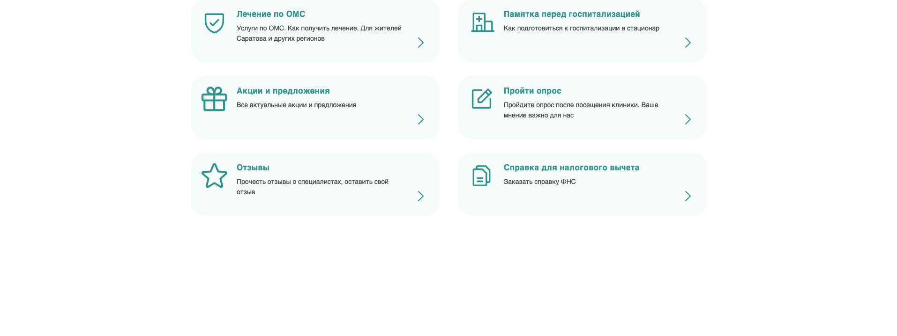

# 🏥 Private Clinic Website

<p align="center">


</p>

<p align="center">

<b>Commercial Frontend Development Portfolio</b>

</p>

<p align="center">

Коммерческий проект по разработке пользовательского интерфейса сайта частной медицинской клиники.

В репозитории опубликованы только страницы и компоненты, разработанные мной.
Полная кодовая база проекта принадлежит заказчику и не публикуется.

</p>

---

# 📋 Содержание

- [О проекте](#-о-проекте)
- [Моя роль](#-моя-роль)
- [Технологии](#-технологии)
- [Структура репозитория](#-структура-репозитория)
- [Выполненные задачи](#-выполненные-задачи)
- [Макеты](#-макеты)
- [Превью](#-превью)
- [Ограничения](#-ограничения)

---

# 📖 О проекте

В рамках коммерческой разработки занимаюсь созданием новых страниц сайта медицинской клиники.

Основные задачи:

- разработка страниц по макетам Figma;
- адаптивная верстка;
- реализация клиентских сценариев на JavaScript;
- подготовка кода для интеграции в существующий проект;
- исправление замечаний после тестирования;
- доработка интерфейсов по обратной связи.

Во время работы приходится учитывать существующую архитектуру проекта, возможные конфликты стилей и отсутствие макетов для промежуточных разрешений экранов.

---

# 👨‍💻 Моя роль

В рамках проекта отвечаю за frontend-разработку новых страниц и компонентов.

Помимо реализации интерфейсов:

- предлагаю улучшения UX/UI;
- самостоятельно проектирую адаптивное поведение страниц;
- взаимодействую с заказчиком при обсуждении требований и вариантов реализации.

---

# 🛠 Технологии

- HTML5
- CSS3
- JavaScript (ES6+)
- PHP (include)
- Git
- Figma

---

# 📂 Структура репозитория

Каждая директория соответствует отдельной коммерческой задаче.

```text
clinic_dr_param/
├── infertilityTreatmentPage/
├── omcPage/
├── patientsPage/
└── README.md
```

---

# 📑 Выполненные задачи

| Задача | Описание | README | Live Demo |
|:--|:--|:--:|:--:|
| 🏥 Лечение бесплодия методом ЭКО | Разработка страницы лечения бесплодия | 📄 | https://clinic-dr-param.onrender.com/ |
| 🩺 Лечение по ОМС | Разработка страницы лечения по ОМС | 📄 | https://clinic-dr-param-omcpage.onrender.com/ |
| 👨‍⚕️ Пациентам | Разработка страницы для пациентов | 📄 | https://clinic-dr-param-patientspage-gop4.onrender.com/ |

---

# 🎨 Макеты

Все страницы разработаны по единому дизайн-макету в **Figma**.

🔗 **Макет проекта**

https://www.figma.com/design/9UdGjXFehVUFzhabiPmoAq/%D0%9C%D0%B0%D0%BA%D0%B5%D1%82%D1%8B-%D0%BA%D0%BB%D0%B8%D0%BD%D0%B8%D0%BA%D0%B8

---

# 📸 Превью

## 🏥 Лечение бесплодия методом ЭКО


---

## 🩺 Лечение по ОМС


---

## 👨‍⚕️ Пациентам



---

Каждая задача содержит:

- 📄 подробный README;
- 🌐 Live Demo;
- 🎨 ссылку на соответствующий макет;
- 💻 исходный код выполненной работы.

---

# 🔒 Ограничения

В репозитории опубликованы только страницы и компоненты, разработанные мной в рамках коммерческой frontend-разработки.

Полная кодовая база проекта, внутренние материалы и другие части сайта не публикуются в соответствии с условиями сотрудничества с заказчиком.