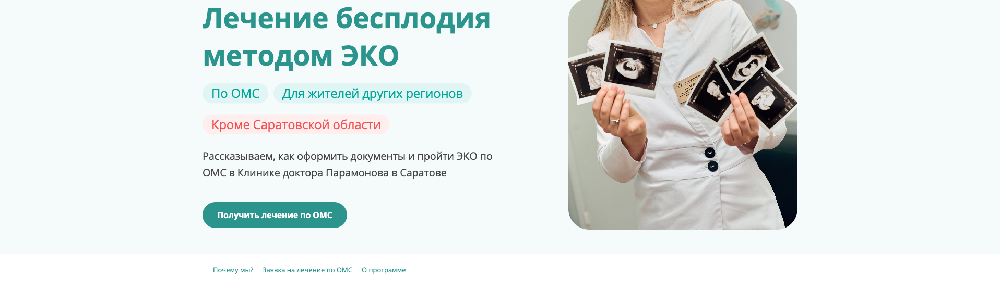
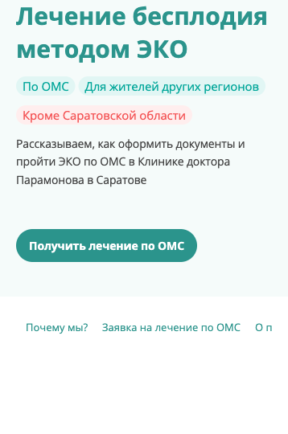

# 🏥 Лечение бесплодия методом ЭКО

> Коммерческая задача по разработке страницы **«Лечение бесплодия методом ЭКО»** для сайта частной медицинской клиники.

---

# 📖 Описание

Страница представляет собой информационный раздел о прохождении процедуры ЭКО по ОМС для жителей других регионов. На странице реализованы первый экран, навигация по разделам и подготовлена структура для последующего наполнения контентом.

Задача выполнена в рамках коммерческой разработки по предоставленному дизайн-макету.

---

# ⚠️ Особенности демонстрационной версии

Полная кодовая база коммерческого проекта недоступна и не публикуется.

По этой причине в демонстрационной версии отсутствует оригинальная шапка сайта. Вместо нее используется временный блок соответствующей высоты, позволяющий сохранить структуру страницы и корректную работу закрепленной навигации.

После интеграции в основной проект данный блок заменяется настоящим `header`.

---

# 🌐 Демонстрация

Для каждой задачи подготовлен `Dockerfile`, который используется для развертывания страницы на платформе **Render**.

Это позволяет просматривать актуальную версию страницы без локального запуска проекта.

**Demo**

> https://clinic-dr-param.onrender.com/

---

# 🎯 Цель задачи

Разработать адаптивную страницу в соответствии с дизайн-макетом, реализовать закрепленную навигацию по разделам страницы и подготовить код для последующей интеграции в существующий коммерческий проект.

---

# 🛠 Что реализовано

- адаптивная верстка первого экрана;
- реализация хлебных крошек;
- блок с информационными тегами;
- кнопка призыва к действию;
- закрепленная навигация по разделам страницы (`sticky`);
- горизонтальная прокрутка навигации на мобильных устройствах;
- семантическая HTML-разметка;
- подготовка структуры страницы для подключения общих компонентов проекта (`header.php` и `footer.php`);
- организация CSS с разделением на глобальные стили, переменные и стили страницы;
- подготовка страницы к интеграции в существующий коммерческий проект.

---

# ⚙️ Особенности реализации

Во время разработки были учтены следующие особенности проекта.

- самостоятельно реализована закрепленная навигация (`position: sticky`), остающаяся видимой при прокрутке страницы;
- для мобильной версии реализована горизонтально прокручиваемая навигация без переноса элементов на новую строку;
- навигационный блок изначально спроектирован с учетом последующего расширения страницы: новые разделы можно добавлять без изменения логики компонента;
- хлебные крошки реализованы с учетом последующей интеграции с существующей шапкой сайта;
- для корректной интеграции страницы потребовалось согласование структуры существующего `header`, поскольку дизайн-макет не содержал всей информации о его реализации;
- размеры шрифтов, отступов и элементов адаптируются с помощью `clamp()`, что позволило сделать масштабирование плавным и сократить количество дополнительных брейкпоинтов;
- структура CSS разделена на глобальные стили, переменные, шрифты и стили страницы для повышения читаемости и удобства сопровождения;
- при разработке учитывалась последующая интеграция страницы в существующий коммерческий проект.

---

# 📂 Структура директории

```text
infertilityTreatmentPage/
├── assets/
├── Dockerfile
├── header.php
├── footer.php
├── index.php
└── script.js
```

### Назначение файлов

| Файл | Назначение |
|------|------------|
| `index.php` | Основная структура страницы и подключение компонентов. |
| `header.php` | Точка подключения общей шапки проекта. В демонстрационной версии используется заглушка соответствующей высоты. |
| `footer.php` | Точка подключения общего подвала проекта. |
| `style.css` | Стили страницы «Лечение бесплодия методом ЭКО». |
| `globals.css` | Общие стили проекта. |
| `variables.css` | CSS-переменные (цвета, размеры, типографика). |
| `fonts.css` | Подключение используемых шрифтов. |
| `script.js` | JavaScript для логики навигации по странице (при наличии). |
| `Dockerfile` | Конфигурация Docker-контейнера для публикации демонстрационной версии страницы на Render. Используется для предоставления заказчику доступа к результату разработки без локального запуска проекта. |

---

# 🎨 Дизайн-макет

Все страницы проекта разработаны по единому файлу Figma.

**Макет страницы**

> https://www.figma.com/design/9UdGjXFehVUFzhabiPmoAq/%D0%9C%D0%B0%D0%BA%D0%B5%D1%82%D1%8B-%D0%BA%D0%BB%D0%B8%D0%BD%D0%B8%D0%BA%D0%B8?node-id=0-1&t=0R7V6LmMiwt2GQVg-1

---

# 📸 Скриншоты

<table>
<tr>
<td align="center">

**Desktop**



</td>
</tr>

<tr>
<td align="center">

**Mobile**



</td>
</tr>
</table>

---

# 🚀 Стек

- HTML5
- CSS3
- JavaScript
- PHP (`include`)
- Docker
- Render

---

# 📌 Примечание

В репозитории опубликован только код, разработанный мной в рамках данной задачи.

Полная кодовая база коммерческого проекта, внутренние компоненты и материалы заказчика не публикуются.